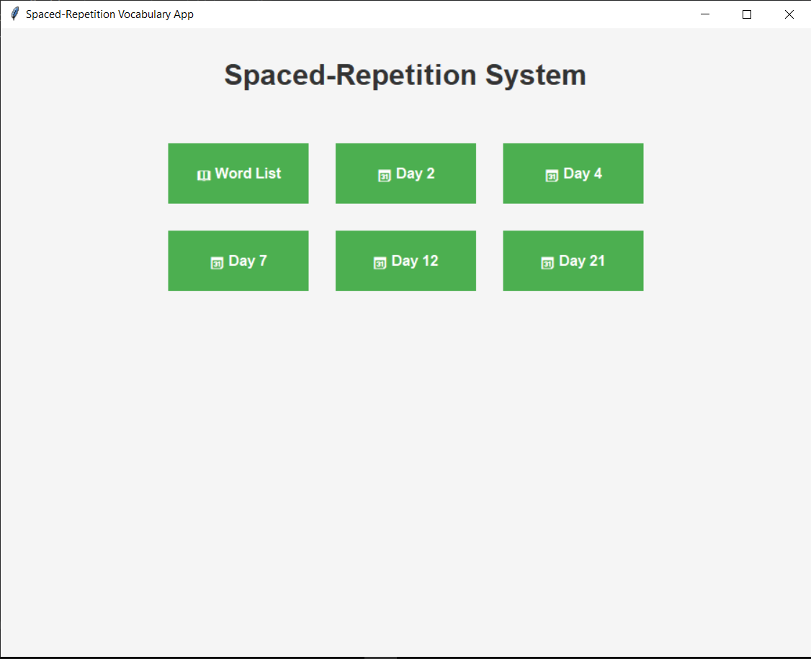

📚 Learning App – Spaced Repetition Vocabulary Trainer
A desktop vocabulary learning application built with Python (Tkinter) and PostgreSQL, designed to help learners memorize words effectively using the spaced repetition method.

✨ Features
🗂 Word Management – Add, update, and delete vocabulary.
⏳ Daily Revision Schedule – Automatically places words into Day 2, Day 4, Day 7, Day 12, and Day 21 review queues.
📖 Example Sentences – Store both French and English examples for each word.
📊 Progress Tracking – See how many words you’ve reviewed and learned.
🎯 Error Tracking – Records wrong answers to focus on problem areas.

🖼 Screenshots
Main Menu

Word Management

Correct Answer

Wrong Answer

🖥️ Tech Stack
Language: Python 3
GUI: Tkinter
Database: PostgreSQL
Other: SQL Triggers, Functions

📦 Installation
1️⃣ Clone the Repository
bash
   git clone https://github.com/your-username/learning-app.git
   cd learning-app
2️⃣ Set up PostgreSQL Database
Create a new database:
sql
   CREATE DATABASE learningdb;
   Import the schema:
bash
   psql -U your_username -d learningdb -f learningdb_schema_only_LF.sql
3️⃣ Install Python Dependencies
bash
   pip install -r requirements.txt
4️⃣ Run the App
bash
   python app.py
🗄 Database Schema
The main table is vocabulary, with child tables Day_2, Day_4, Day_7, Day_12, and Day_21 for spaced repetition scheduling.
Trigger: Automatically adds new words into the Day 2 table after insertion.
Function: Loops through all review days to schedule words.

📂 Project Structure
learning-app/
│-- app.py                 # Main Tkinter application
│-- db.py                  # Database connection functions
│-- learningdb_schema_only_LF.sql   # Database schema
│-- requirements.txt       # Python dependencies
│-- README.md              # This file

🚀 Future Improvements
🔍 Search & filter words
📈 Statistics dashboard
🌐 Support for more languages
📱 Mobile version

🤝 Contributing
Contributions are welcome!
Fork the repo
Create your feature branch (git checkout -b feature/YourFeature)
Commit changes (git commit -m 'Add some feature')
Push to branch (git push origin feature/YourFeature)
Open a Pull Request

